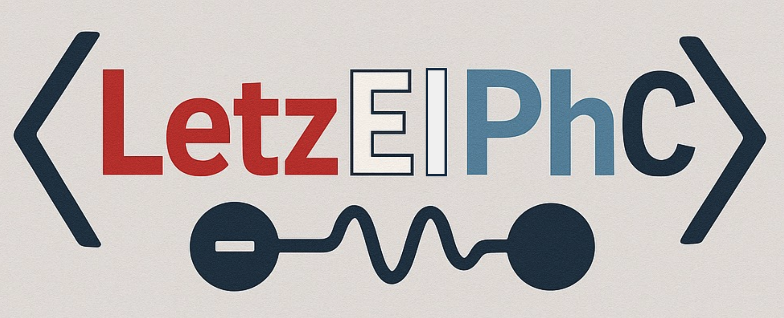

LetzElPhC abbreviates to _"Lëtzebuerg Electron Phonon Code"_.
_"Lëtzebuerg"_ is the Luxembourgish name for the Luxembourg Country.

LetzElPhC is distributed under the MIT license.

Please read ```docs/main.pdf``` for **installing and usage**. A simple example can
be found in ```examples/qe/silicon``` folder

**This code is currently under development. please use at your 
own risk**.

In case of any bugs or other issues, please open a gitlab issue
at https://gitlab.com/lumen-code/LetzElPhC

Any contribtions to the code are always welcomed. Thank you very much 
incase you are willing to contribute.

It should be noted that this code does not compute any other quantities 
apart from electron-phonon matrix elements. In case if you like to compute 
physical properties due to electron-phonon coupling—such as mobilities, etc,
one should prefer other tools such as the EPW code.

# Acknowledgments
Ludger Wirtz (Supervisor)  
Fulvio Paleari (Testing and Yambopy interface)  
University of Luxembourg (Funding)  
HPC @ Uni.lu (Computing resources)  
Henry Fried (Logo)

# TODO  
1) ~~Support XML format for dynamical matrices~~
2) ~~Work on suporting image parallelization of ph.x (preprocessor)~~
3) ~~Prepare automatic test cases~~
4) Improve OPENMP
5) Implement basic Acoustic sum rule
6) ~~Turn on different kernel options for the user~~
7) Frohlich Interpolation
8) DFT + U


