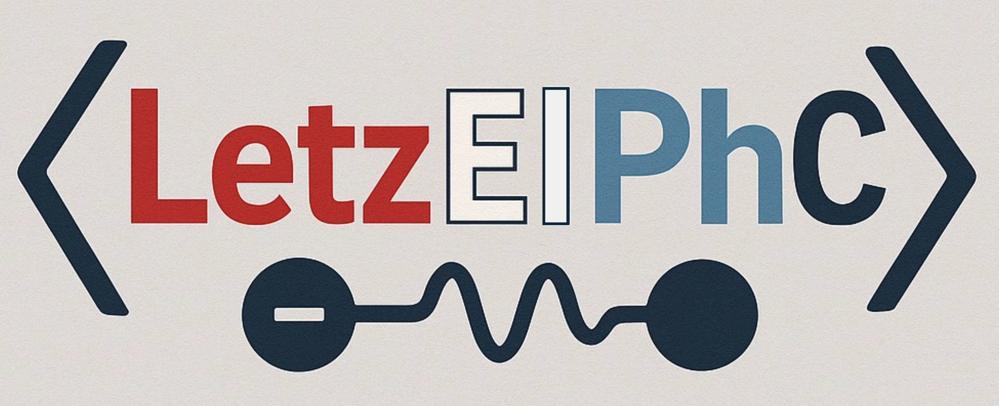

# LetzElPhC

[](https://opensource.org/licenses/MIT)
[](https://yambo-code.github.io/LetzElPhC/)

**LetzElPhC** (_Lëtzebuerg Electron Phonon Code_) is a high-performance C package designed explicitly to compute electron–phonon matrix elements to complement electron-phonon calculations in the [YAMBO](https://www.yambo-code.eu/) code.

*Note: This code strictly focuses on computing only the electron-phonon matrix elements. It does not natively compute any physical quantities.*

---

## 📖 Documentation

Please visit the **[Official Documentation Site](https://yambo-code.github.io/LetzElPhC/)** (actively evolving) for inputs/outputs and usage.

## 🛠 Installation & Usage

LetzElPhC requires standard C compilers, MPI, and external mathematical libraries (FFTW3, NetCDF). 

For a complete step-by-step installation guide—including configuring your `make.inc`—please refer to the [Installation Documentation](https://yambo-code.github.io/LetzElPhC/install_usage/).

## 🧪 Testing

The codebase maintains strict numerical integrity via a massive, highly-parallelized integration test suite driven by `pytest`.

To run the complete suite on your local compilation:
```bash
# 1. Download the required test databases
pytest --download

# 2. Run the C Unit Tests and the Physics Integration Tests
pytest --unittest --testsuite --ncpus=4
```
See the [Test Suite Manual](tests/README.md) on how to use or develop the test suite.

---

## 📝 Roadmap & TODOs

We are actively developing and expanding LetzElPhC. Current objectives:
- [x] Support XML format for dynamical matrices
- [x] Implement image parallelization of `ph.x` (preprocessor)
- [x] Implement automated integration testing
- [x] Custom kernel options
- [ ] Improve OpenMP scaling constraints
- [ ] Implement basic Acoustic Sum Rule (ASR)
- [ ] Fröhlich Interpolation
- [ ] DFT + U support

## ⚖️ License & Open Source Integrity

LetzElPhC is distributed under the **MIT License**.

**Contributors Note:** To preserve our permissive licensing, please strictly avoid incorporating code from GPL-licensed software. Algorithmic concepts and published descriptions are welcome, but implementations must be written independently or derived from permissively licensed sources (MIT, BSD, Apache-2.0).

### FFT Backend Licensing Warning
While LetzElPhC is MIT-licensed, it relies on Fast Fourier Transform backends whose licenses may impose downstream obligations:
- **FFTW3**: Licensed under GPLv2+. Compiling and distributing binaries linked against FFTW3 may subject the compiled executable to the GPL. 
- **Intel MKL**: If using the Intel oneAPI Math Kernel Library via its FFTW3 compatibility layer, you are subject to Intel's specific proprietary or community licensing terms.

---

## 👥 Authors & Acknowledgments

**Authors:**
* **Muralidhar Nalabothula** (Lead Developer)
* **Prof. Ludger Wirtz** (Supervisor)

**Acknowledgments:**
* **Henry Fried**: Project Logo Design
* **Fulvio Paleari**: Testing and Yambopy interface integration
* **Riccardo Reho**: Testing 
* **University of Luxembourg**: Research Funding
* **HPC @ Uni.lu**: High-Performance Computing resources

*In case of any bugs, feature requests, or inquiries, please open an issue on the repository. Contributions are always highly welcome!*


